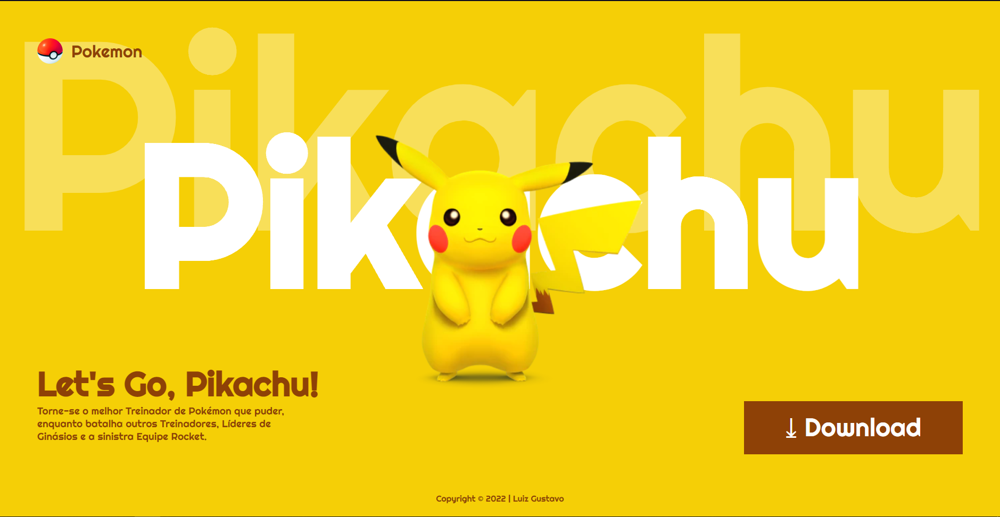

# Page-Pikachu

---

## Sobre
Site do tipo landing page para 
divulgar o persogem de um desenho animado chamado pokemon,
no qual o personagem se chama pikachu.
O objetivo desde projeto é colocar
em prática os conhecimentos, sobre
criação de site adquiridos no curso 
de Desenvolvimento de Sistema no curso 
do [Senai Jandira](https://jandira.sp.senai.br/).

---
## Tecnologias utilizadas
- HTML5
- CSS
- RESPONSIVIDADE
- MARKDOWN

---
## Autor 
- [Luiz Gustavo](https://github.com/luyz-dev)

---
## Contatos
- [Instagram](https://www.instagram.com/luyz.dev/)
- [Linkedin](https://www.linkedin.com/in/luyz-dev)
- WhatsApp: (11) 9-6759-3159